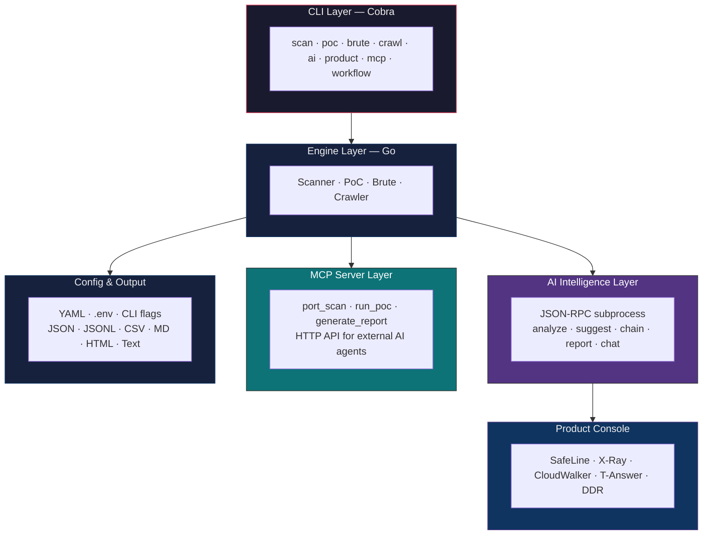
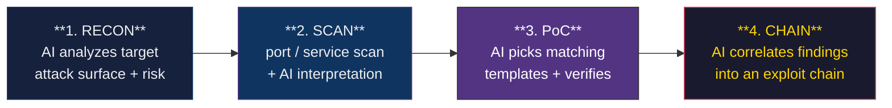

# ClawSec 🛡️⚔️

> **AI-Native Unified Offensive Security CLI Platform**

[](https://github.com/jinyimeng01/clawsec/actions)
[](https://github.com/jinyimeng01/clawsec/releases)
[](https://golang.org)
[](LICENSE)

**ClawSec** is a unified AI-Native network offensive security testing platform, combining high-performance Go networking with intelligent AI decision-making. It integrates port scanning, vulnerability verification (PoC), password brute-forcing, web crawling, AI-assisted analysis, and security product management into a single cohesive CLI tool — and exposes all of it to external AI agents over the Model Context Protocol.

---

## 📑 Table of Contents

- [Overview](#overview)
- [How It Compares](#how-it-compares)
- [✨ Features](#-features)
- [🏗️ System Architecture](#-system-architecture)
- [🧠 AI Workflow Engine](#-ai-workflow-engine)
- [🔍 Engines In Depth](#-engines-in-depth)
- [🤖 AI Agent (JSON-RPC)](#-ai-agent-json-rpc)
- [📦 Security Product Console](#-security-product-console)
- [🔌 MCP Server](#-mcp-server)
- [📦 Installation](#-installation)
- [🚀 Quick Start](#-quick-start)
- [📖 Command Reference](#-command-reference)
  - [`scan`](#scan---network-scanning) · [`poc`](#poc---vulnerability-verification) · [`brute`](#brute---password-brute-forcing)
  - [`crawl`](#crawl---web-crawling) · [`ai`](#ai---ai-security-assistant) · [`product`](#product---security-product-console)
  - [`mcp`](#mcp---model-context-protocol-server) · [`workflow`](#workflow---automated-penetration-testing-workflows)
- [⚙️ Configuration](#-configuration)
- [📊 Output Formats](#-output-formats)
- [🛠️ Development](#-development)
- [⚠️ Legal Disclaimer](#-legal-disclaimer)
- [📄 License](#-license)
- [🙏 Acknowledgments](#-acknowledgments)

---

## Overview

A complete network penetration test traditionally chains 5–8 independent tools (Nmap, Nuclei, Hydra, dirsearch, …), each with its own CLI, output format, and learning curve. ClawSec collapses that chain into **one** binary and puts an AI agent in charge of orchestration: analyze the target, recommend the next step, select matching PoC templates, and correlate findings into an exploit chain.

| Dimension | Traditional toolchain | **ClawSec** |
|-----------|----------------------|-------------|
| Tools needed | 5–8 separate tools | Single CLI binary |
| AI decisions | None | Target analysis, PoC suggestion, exploit-chain building |
| Product management | Multiple vendor consoles | Unified CLI (SafeLine / X-Ray / CloudWalker / T-Answer / DDR) |
| External AI integration | Not supported | Standard MCP server |
| Output formats | Per-tool, inconsistent | 7 unified formats |
| PoC ecosystem | Nuclei-only | Nuclei-YAML compatible |
| Config | Per-tool | YAML + `.env` + CLI flags, layered |

---

## How It Compares

ClawSec is built for operators who want the **whole offensive workflow** — recon, validation, exploitation, reporting — under one command surface, with an AI brain that can drive it autonomously or be driven by external AI clients.

- **One tool, whole kill-chain** — port scan → PoC → brute → crawl → report
- **AI in the loop** — Claude-powered analysis, suggestion, chaining, and reporting
- **Open to AI agents** — every capability is exposed as an MCP tool
- **Unified security product console** — query and control multiple vendor products from one CLI
- **Nuclei-compatible PoC engine** — reuse the community's template ecosystem

---

## ✨ Features

| Module | Description | Protocols / Formats |
|--------|-------------|---------------------|
| **Port Scanner** | SYN / Connect / UDP scanning with adaptive rate control and banner grabbing | TCP, UDP, SYN (raw) |
| **PoC Engine** | Nuclei YAML-compatible vulnerability verification engine | HTTP, TCP, UDP, DNS, SSL, WebSocket |
| **Brute Force** | High-performance password brute-forcing | SSH, FTP, RDP, MySQL, Redis, MongoDB, PostgreSQL, MSSQL, SMB, LDAP, HTTP |
| **Web Crawler** | Directory enumeration, JS analysis, parameter fuzzing | HTTP/HTTPS |
| **AI Agent** | Claude-powered intelligent target analysis and exploit chain building | Anthropic MCP |
| **Product Console** | Unified WAF / Scanner / EDR management | SafeLine, X-Ray, CloudWalker, T-Answer, DDR |
| **MCP Server** | Expose security tools to external AI agents via HTTP API | Model Context Protocol |
| **Workflows** | AI-driven automated penetration testing chains | Multi-step orchestration |

---

## 🏗️ System Architecture

ClawSec is a layered platform: a Cobra CLI drives Go networking engines, an AI intelligence layer talks to a TypeScript "AI brain" subprocess over JSON-RPC, a product console abstracts vendor APIs, and an MCP server exposes everything to external AI clients.



| Layer | Responsibility |
|-------|----------------|
| **CLI** | Unified Cobra entry point; validates the `--authorized` flag, loads config, dispatches subcommands |
| **Engine** | Concurrent Go scanners — port scan, Nuclei-compatible PoC, multi-protocol brute, web crawler |
| **AI Intelligence** | Talks to the AI brain subprocess over JSON-RPC 2.0 stdio; 5 RPC methods |
| **Product Console** | Interface + registry pattern; one adapter per vendor product, auto-registered via `init()` |
| **MCP Server** | Standard MCP endpoints exposing tools to Claude / Cursor / any MCP client |
| **Config & Output** | Layered config and 7 output renderers |

---

## 🧠 AI Workflow Engine

The `workflow` command runs an AI-driven, four-stage penetration test pipeline. Each stage feeds the next, and the AI brain decides what to act on.



| Stage | What happens |
|-------|--------------|
| **1. Reconnaissance** | AI Agent evaluates the target, estimates attack surface, scores risk, recommends the first move |
| **2. Port Scanning** | Scanner engine runs TCP/UDP port scan; AI interprets banners and open services |
| **3. Vulnerability Verification** | AI filters matching PoC templates (by severity / tags) and the PoC engine validates them |
| **4. Exploit Chain Building** | AI correlates verified findings into a multi-step chain — each step has an action, tool, and expected outcome |

Stages run **fully automated** via `workflow run`, or **step-by-step** via the individual `scan` / `poc` / `ai` commands.

---

## 🔍 Engines In Depth

### PoC Engine (Nuclei-YAML compatible)

A self-contained implementation of the Nuclei YAML template format.

**Matchers** — 6 types, composable with `and` / `or` and a `negative` modifier:

| Matcher | Logic |
|---------|-------|
| `word` | substring search in body / headers / raw |
| `regex` | Go regexp match |
| `status` | HTTP status code match |
| `binary` | hex-decoded binary match |
| `dsl` | DSL expression evaluation |
| `size` | response body byte-size match |

**Extractors** — 5 types: `regex`, `json` (dot-path), `kval` (header key-value), `xpath`, `dsl`.

**DSL engine** — 25+ built-in functions: hashes (`md5`/`sha1`/`sha256`), encodings (`base64`/`hex`/`url`), string ops (`trim`/`replace`/`contains`), random generators (`rand_base`/`rand_text`/`rand_int`/`rand_ip`), HTML escaping, and boolean composition (`&&` / `||`). Auto-initialized context variables: `BaseURL`, `Hostname`, `Host`, `Port`, `Path`, `Scheme`.

**Execution** — two-level concurrency: templates run in parallel, and each template scans its targets in parallel. Supports `StopAtFirstMatch` and multi-step workflow chains with variable passing.

**Filtering** — by severity (`critical`/`high`/`medium`/`low`/`info`) and tags (`cve`, `rce`, `xss`, …).

### Brute Engine

Strategy-pattern design with a shared concurrent runner. Four combination modes:

| Mode | Behavior |
|------|---------|
| `cartesian` | every user × every password × every target |
| `pair` | user[i] ↔ password[i] paired |
| `cycle-user` | fixed password set, rotate users |
| `cycle-pass` | fixed user set, rotate passwords |

Protocols: SSH (password + key auth), FTP, RDP, MySQL, Redis, MongoDB, PostgreSQL, MSSQL, SMB, LDAP, HTTP. Ships with a built-in default credential list.

### Crawler Engine

Worker-pool directory enumeration. Smart-extension expansion (`.php`, `.asp`, `.aspx`, `.jsp`, `.html`, `.txt`, `.bak`, `.old`, `.zip`, `.tar.gz`, `.sql`, …), title extraction from the first 4 KB, redirect tracking, 80+ built-in paths, and configurable status-code tracking.

---

## 🤖 AI Agent (JSON-RPC)

The Go binary launches a TypeScript **AI brain** subprocess and communicates over JSON-RPC 2.0 on stdin/stdout. The runtime auto-detects Bun, Node.js, or a compiled binary.

| RPC method | Purpose | Returns |
|------------|---------|---------|
| `analyze` | Intelligent target analysis | risk score, attack surface, recommended next steps |
| `suggest` | PoC template suggestion | template list (id, name, severity, confidence) + priority order |
| `chain` | Exploit-chain construction | steps (action, tool, expected outcome) + confidence |
| `report` | Pen-test report generation | Markdown / HTML report |
| `chat` | Interactive assistant | conversational response |

Requests carry a unique ID; responses are matched back to the request channel asynchronously, with a default 60 s timeout.

> **Requirements:** Bun runtime, `ANTHROPIC_API_KEY`, and a built `ai-brain/` (`cd ai-brain && bun install`).

---

## 📦 Security Product Console

A plugin-style console unifies multiple vendor products behind one `Product` interface (`Connect` / `Query` / `Execute`). Adapters self-register via Go's `init()` mechanism.

| Product | Type | Query capabilities | Execute capabilities |
|---------|------|-------------------|---------------------|
| **SafeLine** | WAF | version, sites, attack_logs, blocked_ips | block_ip, unblock_ip, add_rule |
| **X-Ray** | Vulnerability scanner | version, tasks, vulnerabilities, assets | create_task, start_task, stop_task |
| **CloudWalker** | CWPP | _planned_ | _planned_ |
| **T-Answer** | Traffic threat detection | _planned_ | _planned_ |
| **DDR** | Data security | _planned_ | _planned_ |

A `BaseProduct` helper provides HTTP client setup, TLS configuration, auth-header injection, and connection state.

---

## 🔌 MCP Server

Run ClawSec as a **Model Context Protocol** server so external AI agents (Claude Desktop, Cursor, …) can drive its tools.

**Endpoints:**

| Method | Path | Description |
|--------|------|-------------|
| `GET` | `/mcp/health` | Health check (status + tool count) |
| `GET` | `/mcp/tools` | List tool metadata + input schemas |
| `POST` | `/mcp/call` | Invoke a tool with JSON params |

**Registered tools:** `port_scan` (target, ports), `run_poc` (template, target), `generate_report` (target, format). Each carries a full JSON Schema input definition.

---

## 📦 Installation

### One-Line Installer

**Linux / macOS:**
```bash
curl -fsSL https://raw.githubusercontent.com/jinyimeng01/clawsec/main/install.sh | bash
```

**Windows (PowerShell):**
```powershell
iwr -useb https://raw.githubusercontent.com/jinyimeng01/clawsec/main/install.ps1 | iex
```

### Pre-built Binaries

Download the latest release for your platform from the [Releases](https://github.com/jinyimeng01/clawsec/releases) page.

Supported platforms:
- **Linux**: `amd64`, `arm64`
- **macOS**: `amd64`, `arm64` (Apple Silicon)
- **Windows**: `amd64`

```bash
# Example: Linux AMD64
curl -LO https://github.com/jinyimeng01/clawsec/releases/latest/download/clawsec-linux-amd64.tar.gz
tar -xzf clawsec-linux-amd64.tar.gz
chmod +x clawsec
sudo mv clawsec /usr/local/bin/
```

### Build from Source

Requirements: **Go 1.22+**

```bash
git clone https://github.com/jinyimeng01/clawsec.git
cd clawsec
go build -o clawsec ./cmd/clawsec
./clawsec version
```

Cross-compile for all platforms:
```bash
# Linux
GOOS=linux GOARCH=amd64 go build -o clawsec-linux-amd64 ./cmd/clawsec

# macOS
GOOS=darwin GOARCH=arm64 go build -o clawsec-darwin-arm64 ./cmd/clawsec

# Windows
GOOS=windows GOARCH=amd64 go build -o clawsec-windows-amd64.exe ./cmd/clawsec
```

---

## 🚀 Quick Start

```bash
# Show help
clawsec --help

# Port scan top 100 ports on a subnet
clawsec scan port -t 10.0.0.0/24 -p top100

# Full port SYN scan with banner grabbing (requires root)
sudo clawsec scan port -t 10.0.0.1 -p 1-65535 --syn --banner

# Run a PoC template against a target
clawsec poc run -t CVE-2021-41773.yaml -u http://target.com

# Run all critical/high PoCs from a directory
clawsec poc run -d ./nuclei-templates/ -u targets.txt -s critical,high

# SSH brute force
clawsec brute ssh -t 10.0.0.1 -u root -P passwords.txt --threads 50

# Directory enumeration
clawsec crawl dir -t http://target.com -w wordlist.txt --ext

# AI-assisted target analysis
clawsec ai analyze -t 10.0.0.1 --context "Apache 2.4.41, PHP 7.4"

# Interactive AI security assistant
clawsec ai chat

# Run automated penetration testing workflow
clawsec workflow run -t 10.0.0.0/24 --objective "find all vulnerabilities"
```

---

## 📖 Command Reference

### `scan` - Network Scanning

High-performance network scanning engine supporting multiple scan modes.

**Subcommands:**
- `port` — TCP/UDP port scanning (SYN/Connect/UDP)
- `service` — Service fingerprinting and version detection
- `web` — Web asset discovery and technology fingerprinting

```bash
# TCP Connect scan of top 100 ports
clawsec scan port -t 10.0.0.0/24

# Full port SYN scan with banner grabbing (root required)
clawsec scan port -t 10.0.0.1 -p 1-65535 --syn --banner

# UDP scan
clawsec scan port -t 10.0.0.1 -p 53,161 --udp

# Service version detection
clawsec scan service -t 10.0.0.1 -p 22,80,443,3306

# Web fingerprinting
clawsec scan web -t urls.txt
```

**Flags:**
| Flag | Description | Default |
|------|-------------|---------|
| `-t, --target` | Target hosts/CIDR/URLs (required) | — |
| `-p, --ports` | Port range (`80,443`, `1-65535`, `top100`, `top1000`) | `top100` |
| `--syn` | Use SYN stealth scan (requires root) | false |
| `--udp` | Use UDP scan | false |
| `--banner` | Grab service banners | false |
| `--rate` | Packets per second rate limit | — |
| `--threads` | Concurrent threads | 50 |
| `--timeout` | Connection timeout (seconds) | 3 |

---

### `poc` - Vulnerability Verification

Execute vulnerability proof-of-concept templates compatible with the Nuclei YAML format.

**Features:**
- Full Nuclei YAML template syntax support
- HTTP / TCP / UDP / DNS / SSL / WebSocket / Headless / Code protocols
- DSL expression engine with 50+ built-in functions
- Multi-step workflow chains with variable passing
- Automatic template updates from community repository

**Subcommands:**
- `run` — Run PoC templates against targets
- `list` — List available PoC templates
- `update` — Update PoC templates from remote repository

```bash
# Run a single template against a target
clawsec poc run -t CVE-2021-41773.yaml -u http://target.com

# Run all templates in a directory against multiple targets
clawsec poc run -d ./poc/ -u targets.txt

# Filter by severity and tags
clawsec poc run -d ./nuclei-templates/ -u targets.txt -s critical,high -t cve,rce

# Update templates from remote repository
clawsec poc update

# List available templates
clawsec poc list
```

---

### `brute` - Password Brute-forcing

High-performance password brute-forcing engine supporting 10+ protocols.

**Supported Protocols:**
`ssh`, `ftp`, `rdp`, `mysql`, `redis`, `mongodb`, `postgres`, `mssql`, `smb`, `ldap`, `http`

```bash
# SSH brute force with password list
clawsec brute ssh -t 10.0.0.1 -u root -P passwords.txt

# Multiple targets with multiple users
clawsec brute ssh -t targets.txt -U users.txt -P passwords.txt --threads 100

# Redis brute force (no username)
clawsec brute redis -t 10.0.0.1 -P passwords.txt

# HTTP Basic auth brute force
clawsec brute http -t http://target.com -u admin -P passwords.txt
```

---

### `crawl` - Web Crawling

Web crawling and directory enumeration engine.

**Subcommands:**
- `dir` — Directory and file enumeration (dirbuster-style)
- `js` — JavaScript file discovery and endpoint extraction
- `params` — Parameter enumeration and fuzzing

```bash
# Directory enumeration with default wordlist
clawsec crawl dir -t http://target.com

# Custom wordlist with smart extensions
clawsec crawl dir -t http://target.com -w /path/to/wordlist.txt --ext -T 50

# JavaScript endpoint extraction
clawsec crawl js -t http://target.com

# Parameter fuzzing
clawsec crawl params -t http://target.com/api
```

---

### `ai` - AI Security Assistant

Interact with the AI security brain for intelligent offensive security analysis. Powered by **Anthropic Claude** via Model Context Protocol (MCP).

**Requirements:**
- [Bun](https://bun.sh) runtime installed
- `ANTHROPIC_API_KEY` environment variable set
- `ai-brain/` TypeScript agent built (`cd ai-brain && bun install`)

**Subcommands:**
- `analyze` — Analyze target and suggest attack paths
- `suggest` — Suggest PoC templates based on fingerprints
- `chain` — Build exploit chains from discovered vulnerabilities
- `report` — Generate professional penetration test reports
- `chat` — Interactive AI security assistant

```bash
# Analyze a target and get attack recommendations
clawsec ai analyze -t 10.0.0.1 --context "Apache 2.4.41, PHP 7.4, MySQL 5.7"

# Suggest PoCs based on service fingerprint
clawsec ai suggest -t http://target.com --fingerprint "Apache/2.4.41, PHP/7.4"

# Generate report from scan results
clawsec ai report -i results.json -o report.md

# Interactive AI assistant
clawsec ai chat
```

---

### `product` - Security Product Console

Manage and interact with various security products from a unified CLI interface.

**Supported Products:**
| Product | Description |
|---------|-------------|
| `safeline` | Chaitin SafeLine WAF |
| `xray` | Chaitin X-Ray vulnerability scanner |
| `cloudwalker` | Chaitin CloudWalker CWPP |
| `tanswer` | Chaitin T-Answer traffic threat detection |
| `ddr` | Chaitin DDR data security |

**Subcommands:**
- `list` — List configured products
- `config` — Configure product credentials
- `query` — Query product data
- `exec` — Execute product commands

```bash
# List configured products
clawsec product list

# Query WAF attack logs
clawsec product query safeline attack_logs

# Block IP on WAF
clawsec product exec safeline block_ip --ip 1.2.3.4
```

---

### `mcp` - Model Context Protocol Server

Run ClawSec as an MCP server to expose security tools to AI agents.

**Endpoints:**
| Method | Path | Description |
|--------|------|-------------|
| `GET` | `/mcp/health` | Health check |
| `GET` | `/mcp/tools` | List available tools |
| `POST` | `/mcp/call` | Execute a tool |

```bash
# Start MCP server on port 8080
clawsec mcp serve --port 8080
```

Integrates with Claude, Cursor, and other MCP-compatible clients.

---

### `workflow` - Automated Penetration Testing Workflows

AI-driven automated penetration testing workflows. The workflow engine uses AI to plan and execute multi-step attack chains, integrating port scanning, PoC execution, and vulnerability verification.

```bash
# Full reconnaissance workflow
clawsec workflow run -t 10.0.0.1 --objective "find all vulnerabilities"

# Targeted exploit chain
clawsec workflow run -t http://target.com --objective "achieve RCE"

# Stealth assessment
clawsec workflow run -t 10.0.0.0/24 --strategy stealth
```

---

## ⚙️ Configuration

ClawSec uses a YAML configuration file located at `~/.clawsec/config.yaml`.

**Load priority (high → low):**

1. Command-line flags (`--threads 100 --timeout 10`)
2. Environment variables (`CLAWSEC_THREADS=100`)
3. `.env` file
4. `~/.clawsec/config.yaml`
5. Built-in defaults

**Example configuration:**

```yaml
# ClawSec Configuration File
# https://github.com/jinyimeng01/clawsec

output_format: text
timeout: 5
threads: 50
rate_limit: 150

# Network settings
user_agent: "ClawSec/0.1.0"
random_ua: false
proxy: "http://127.0.0.1:8080"
force_proxy: false
insecure_ssl: false
follow_redirects: true
max_redirects: 10

# Attack settings
authorized: false
stealth: false

# AI settings
ai:
  enabled: false
  endpoint: ""
  model: "claude-sonnet-4-20250514"
  api_key: ""

# Product configurations
# safeline:
#   url: "https://safeline.example.com"
#   api_key: "your-api-key"
# xray:
#   url: "https://xray.example.com"
#   api_key: "your-api-key"
```

Use `-c, --config` to specify a custom config file:
```bash
clawsec -c /path/to/config.yaml scan port -t 10.0.0.1
```

---

## 📊 Output Formats

ClawSec supports multiple output formats via the `-f, --format` flag:

| Format | Description | Use Case |
|--------|-------------|----------|
| `text` | Human-readable colored table output | Interactive terminal use |
| `json` | Single JSON array of all results | Integration with other tools |
| `jsonl` | One JSON object per line (NDJSON) | Streaming processing |
| `csv` | Comma-separated values | Spreadsheet import |
| `markdown` | Markdown table | Documentation |
| `html` | Dark-themed HTML report | Client deliverables |
| `silent` | No output | Shell scripting |

```bash
# JSON output to file
clawsec scan port -t 10.0.0.1 -f json -o results.json

# HTML report
clawsec scan port -t 10.0.0.1 -f html -o report.html

# Silent mode (exit code only)
clawsec scan port -t 10.0.0.1 -s
```

---

## 🛠️ Development

### Prerequisites

- Go 1.22+
- (Optional) Bun runtime for AI features
- (Optional) Docker for containerized builds

### Project Structure

```text
clawsec/
├── cmd/clawsec/          # Main entry point
├── internal/
│   ├── cli/              # Cobra CLI commands
│   ├── config/           # Configuration management
│   ├── logger/           # Structured logging
│   ├── output/           # Output formatting (text/json/csv/html)
│   ├── runner/           # Scan execution runner
│   └── constants/        # Version and build info
├── pkg/
│   ├── engine/
│   │   ├── scanner/      # Port scanner (SYN/Connect/UDP)
│   │   ├── poc/          # PoC engine (Nuclei-compatible)
│   │   ├── brute/        # Brute-force protocols
│   │   └── crawler/      # Web crawler
│   ├── ai/               # AI agent integration
│   ├── mcp/              # MCP server implementation
│   └── products/         # Security product adapters
├── ai-brain/             # TypeScript AI brain (MCP)
├── .github/workflows/    # CI/CD (GitHub Actions)
├── install.sh            # Linux/macOS installer
├── install.ps1           # Windows installer
└── README.md
```

### Build & Test

```bash
# Build
go build -o clawsec ./cmd/clawsec

# Run tests
go test -v ./...

# Run with race detector
go test -race ./...

# Lint
golangci-lint run

# Cross-compile (uses GoReleaser or manual GOOS/GOARCH)
GOOS=linux GOARCH=amd64 go build -ldflags "-s -w" -o dist/clawsec-linux-amd64 ./cmd/clawsec
```

### AI Brain Setup

```bash
cd ai-brain
bun install
bun run build
# Set ANTHROPIC_API_KEY environment variable
```

---

## ⚠️ Legal Disclaimer

**This tool is intended for authorized security testing only.**

You must have **explicit written permission** to test any target system. Unauthorized access to computer systems is illegal in most jurisdictions. The authors assume no liability for misuse or damage caused by this program.

**Always ensure:**
- You own the target system, or
- You have explicit written authorization from the owner, or
- You are operating in a controlled lab environment

Use at your own risk.

---

## 📄 License

This project is licensed under the **GPL-3.0 License**. See [LICENSE](LICENSE) for details.

---

## 🙏 Acknowledgments

- [Nuclei](https://github.com/projectdiscovery/nuclei) — YAML template format inspiration
- [Cobra](https://github.com/spf13/cobra) — CLI framework
- [Anthropic](https://anthropic.com) — AI model provider
- [Model Context Protocol](https://modelcontextprotocol.io) — AI integration standard
